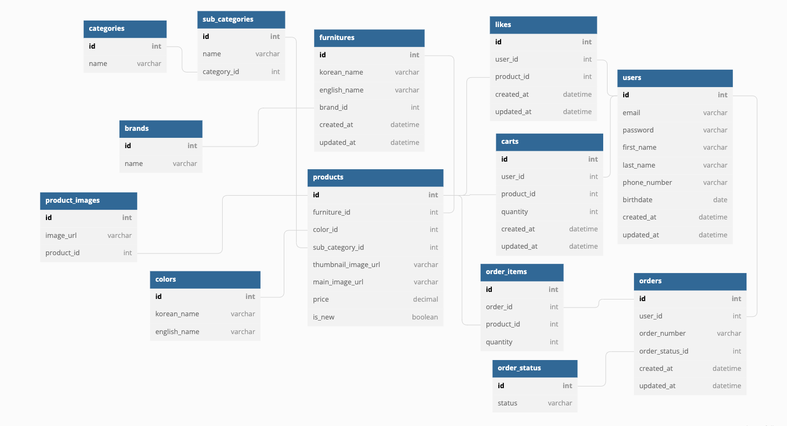

## 1차 프로젝트 Back-end 소개

- 가구 판매 사이트 [까사리빙](https://www.casa.co.kr/) 클론 프로젝트
- 2주 간의 프로젝트 기간 동안 완성을 목표로 사이트 필수 구현기능을 구현했습니다.
- 개발환경 초기세팅, DB모델링, 기능구현

### 개발 인원 및 기간

- 개발기간 : 2022/7/18 ~ 2022/7/29 (2주)
- 개발 인원 : 프론트엔드 4명, 백엔드 3명
- [프론트 github 링크](https://github.com/wecode-bootcamp-korea/35-1st-2sa-living-frontend)

### 프로젝트 선정이유

- 그동안 학습한 내용을 바탕으로 구현할 수 있는, 회원가입 로그인 제품확인 좋아요 장바구니 주문하기 기능을 가진 커머스 사이트이면서 깔끔한 화면 구성이 마음에 들어서 선정.

### DB 모델링

### 프로젝트 시연 영상

 

## 적용 기술 및 구현 기능

### 적용 기술

> Back-End : Python, Django web framework, Bcrypt, JWT, My SQL

 

### 구현 기능

- 회원가입 / 로그인
- 제품 리스트 
  - 카테고리 별 제품 
  - 페이지네이션 (limit 값 선택가능) 
  - 제품 정렬방식 선택 
  - 필터링 기능
- 제품 정보 상세보기
  - 관련 상품 리스트 제공
  
- 장바구니
- 주문하기
- 리뷰 

 

## Reference

- 이 프로젝트는 [까사리빙](https://www.casa.co.kr/) 사이트를 참조하여 학습목적으로 만들었습니다.
- 실무수준의 프로젝트이지만 학습용으로 만들었기 때문에 이 코드를 활용하여 이득을 취하거나 무단 배포할 경우 법적으로 문제될 수 있습니다.
- 이 프로젝트에서 사용하고 있는 사진 대부분은 위코드에서 구매한 것이므로 해당 프로젝트 외부인이 사용할 수 없습니다.
